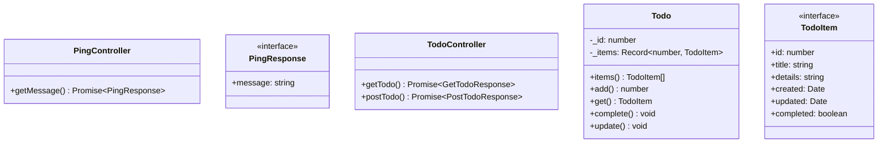

# UML

Generate UML diagrams.  

## Generate

```sh
# if on nixos
nix-shell -p nodejs_20 --command zsh

# just svg
npm exec -- tsuml2  --glob "../34_todo_api/**/*.ts" --tsconfig "../34_todo_api/tsconfig.json" --out ./out/34_todo_api.svg

# mermaid
npm exec -- tsuml2  --glob "../34_todo_api/**/*.ts" --tsconfig "../34_todo_api/tsconfig.json" --outMermaidDsl ./out/34_todo_api.mermaid

```

## Diagrams



## Resources

* https://github.com/demike/TsUML2/tree/master